Required Packages
```{r warning=FALSE, message=FALSE}
if (! requireNamespace("BiocManager", quietly = TRUE)) {
  install.packages("BiocManager")
}
if (! requireNamespace("Biobase", quietly = TRUE)) {
  BiocManager::install("Biobase")
}
if (! requireNamespace("edgeR", quietly = TRUE)) {
  BiocManager::install("edgeR")
}
if (!requireNamespace("biomaRt", quietly = TRUE)) {
   BiocManager::install("biomaRt")
}
if (! requireNamespace("GEOquery", quietly = TRUE)) {
  BiocManager::install("GEOquery")
}
if (!requireNamespace("GEOmetadb", quietly = TRUE)){
  BiocManager::install("GEOmetadb")
}
if (!requireNamespace("ComplexHeatmap", quietly = TRUE))
  BiocManager::install("ComplexHeatmap")

if (!requireNamespace("edgeR", quietly = TRUE))
  install.packages("edgeR")

if (!requireNamespace("ggplot2", quietly = TRUE))
  install.packages("ggplot2")

if (!requireNamespace("tidyr", quietly = TRUE))
  install.packages("tidyr")

if (!requireNamespace("dplyr", quietly = TRUE))
  install.packages("dplyr")

if (!requireNamespace("circlize", quietly = TRUE))
  install.packages("circlize")

if (!requireNamespace("knitr", quietly = TRUE))
  install.packages("knitr")

if (! requireNamespace("RCurl", quietly=TRUE)) {
    install.packages("RCurl")
}
if (! requireNamespace("GSA", quietly=TRUE)) {
    install.packages("GSA")
}
if (! requireNamespace("VennDiagram", quietly=TRUE)) {
    install.packages("VennDiagram")
}
library("VennDiagram")
library(BiocManager)
library(Biobase)
library(edgeR)
library(biomaRt)
library(GEOquery)
library(GEOmetadb)
library(ComplexHeatmap)
library(dplyr)
library(knitr)
```


# Introduction
Over the course of BCB420, our task was to explore the fundamentals of gene expression analysis. Our first step was to choose an expression dataset that was of interest to us on a platform such as RNASeq or microarrays. To ensure quality data was selected, the dataset must have good coverage, a sufficient number of experiments and no older than 10 years. An experiment that was of interest for me was to investigate  expression data involving SARS-Covid-19 in light of the ongoing pandemic. In summary, our task was to clean and normalize this dataset, conduct differential gene expression analyis, run a thresholded gene set enrichment analysis, as well as a non-thresholded gene set enrichment analysis and finally to interpret and take a take a deeper look at the results. At each step, visualization techniques were accompanied and interpreted with the results. 

## Assignment 1: Data Selection and Normalization
The expression data set I choose is [GSE157852](https://www.ncbi.nlm.nih.gov/geo/query/acc.cgi?acc=GSE157852) Human Pluripotent Stem Cell-Derived Neural Cells and Brain Organoids Reveal SARS-CoV-2 Neurotropism Predominates in Choroid Plexus Epithelium [1]. There have been a significant number of reports involving neurological complications, such as encephalopathy, dizziness, headache as well as neuropsychiatric issues, including new onset psychosis, neurocognitive syndrome, and affective disorders [2][3]. This study sheds light on the factors at play involving these symptoms. Bulk RNA-seq of choroid plexus organoids (CPOs) was conducted and raw counts were supplied. I thought this was a fascinating experimental technique conducted with organoid tissue, given the limitations of accessing autopsied human brain tissue infected with Covid. 

__Overview of the data__

```{r warning=FALSE}
gse <- getGEO("GSE157852",GSEMatrix=FALSE)

if (! exists("GSE157852")) {
gse <- getGEO("GSE157852", GSEMatrix = FALSE)
}

data.frame(head(Meta(gse)))

```
__Platform title__: NextSeq 550 (Homo sapiens)  
__Submission data__: Apr 05 2016  
__Last update data__: Dec 05 2018  
__Organims__: Homo sapiens  
__Number of GEO datasets that use this techology__: 289  
__Number of GEO samples that use this technology__: 9090  

```{r warning=FALSE, message=FALSE}
normalized_data <- readRDS(file=file.path(getwd(),"dataBCB","normalizedClean_counts.RDS"))
normalized <- normalized_data %>% 
  log2() %>% 
  as.data.frame() %>% 
  tidyr::gather(key=sample, value=log_cpm)
```


```{r warning=FALSE, message=FALSE}
# Normalized Density plot 
ggplot2::ggplot(normalized, ggplot2::aes(x=log_cpm, color=sample)) +
  ggplot2::geom_density() + ggplot2::labs(title = " Normalized Density Plot") + 
  ggplot2::theme(legend.position="right")
```

```{r warning=FALSE, message=FALSE}
#Normalized box plot
ggplot2::ggplot(normalized, ggplot2::aes(x = sample, y = log_cpm, 
    color = sample)) + ggplot2::geom_boxplot() + ggplot2::coord_flip() + ggplot2::labs(title = "Normalized Box Plot") + 
    ggplot2::theme(legend.position = "none")
```

## Assignment 2: Differential Gene Expression Analysis
In this stage, our task was to take the normalized expression data and perform differential gene expression analysis. The method I chose was using edgeR's quasi likelihood model because my data is a bulk RNASeq dataset. This model is most commonly used for bulk RNAseq datasets as it allows for greater variability and overdispersion in the data.


I first define my sample groups.
```{r}
## define samples and categorize them in their designated treatment group
samples <- data.frame(lapply(colnames(normalized_data),
FUN=function(x){unlist(strsplit(x, split = "_", 3))[c(2,3)]}))
colnames(samples) <- colnames(normalized_data)
rownames(samples) <- c("Type", "Condition") #assign groups
samples <- data.frame(t(samples))
samples$treatment <- apply(samples[, 1:2], 1, paste, collapse = "_")
```

I will be performing differential analysis on the SARS-CoV-2 group as the sample types are categorized in either the "Mock" (vehicle control group) or the "SARS.CoV.2" group which is the condition type. For the SARS.CoV.2 group, 2345 genes passed the p-value threshold and 1029 genes passed correction.
```{r}
model_type <- model.matrix(~ samples$Type)
dge <- edgeR::DGEList(counts=normalized_data, group=samples$Type)
disp <- edgeR::estimateDisp(dge, model_type) # Estimate Dispersion
fitt <- edgeR::glmQLFit(disp, model_type) # Fit the model

#Differentially expressed genes in the SARS.CoV.2 group
qlf.SARS.COV2 <- glmQLFTest(fitt, coef='samples$TypeSARS.CoV.2')
kable(topTags(qlf.SARS.COV2), type="html",digits = 32)

SARS.COV2OutputHits <- topTags(qlf.SARS.COV2,sort.by = "PValue", n = nrow(normalized_data))

#How many genes passed threshold p-value < 0.05?
length(which(SARS.COV2OutputHits$table$PValue < 0.05)) #2345
length(which(SARS.COV2OutputHits$table$FDR < 0.05)) #1029
```

__Visualization with a Volcano Plot__
```{r}
# volcano plot for SARS.CoV.2
vol <- cbind(SARS.COV2OutputHits$table$logFC, -log10(SARS.COV2OutputHits$table$PValue))
colnames(vol) <- c("logFC", "P-value")
upregulated <- SARS.COV2OutputHits$table$PValue < 0.05 & SARS.COV2OutputHits$table$logFC > 0
downregulated <- SARS.COV2OutputHits$table$PValue < 0.05 & SARS.COV2OutputHits$table$logFC < 0

point.col = case_when(upregulated ~ "red",downregulated ~ "blue",TRUE ~ "black")
plot(vol, col = point.col,main="SARS-CoV-2 Genes of Interest", cex.main=1, xlim = c(-3,5), ylim = c(0, 11))
legend("topright", legend=c("Upregulated", "Downregulated"), col=c("red", "blue"), pch=0.1, pt.cex = 1, cex=0.65)
```

__HeatMap__
```{r}
heatmapMatrix <- t(scale(t(normalized_data)))

top_hits <- rownames(SARS.COV2OutputHits$table)[SARS.COV2OutputHits$table$PValue<0.05] 

heatmap_matrix_tophits <- t(scale(t(heatmapMatrix[which(rownames(heatmapMatrix) %in% top_hits),])))


if(min(top_hits) == 0){
  heatmapCol = circlize::colorRamp2(c(min(heatmap_matrix_tophits), 0, max(heatmap_matrix_tophits)), 
                                  c("blue", "white", "red"))
  } else {
    heatmapCol = circlize::colorRamp2(c(min(heatmap_matrix_tophits), 0, max(heatmap_matrix_tophits)), 
                                      c("blue", "white", "red"))
  }

#heatmap annotations
ha <- ComplexHeatmap::HeatmapAnnotation(
                                   type = anno_block(gp = gpar(fill = 2:4), 
                                   labels = c("Mock-72hpi", "SARS-CoV-2-24hpi", "SARS-Cov2-72hpi"), 
                                   labels_gp = gpar(col = "white", fontsize = 10)))
                                   split = rep(1:3, each = 3)

heatmap <- ComplexHeatmap::Heatmap(as.matrix(heatmap_matrix_tophits), 
                                   cluster_rows = TRUE,
                                   cluster_columns = FALSE,
                                   show_row_dend = TRUE, 
                                   show_column_dend = FALSE, 
                                   col = heatmapCol, 
                                   show_column_names = TRUE, 
                                   show_row_names = FALSE, 
                                   show_heatmap_legend = TRUE,
                                   column_split = split,
                                   top_annotation = ha,
                                   column_title = NULL)
heatmap
```
In this heatmap, there appears to be clustering that is more apparent among the SARS-CoV-2-72hpi group, this makes sense as 72 hours post infection should cause the genes to be more differentially expressed.

### Threshold Over-Representaion Analysis
In order to perform over-representation analysis, we must first obtain all the significantly expressed genes with the threshold p-value of 0.05. I recomputed threshold Over representation analysis with g:profiler as I was not satisfied with my initial results. 
```{r}
#export upregulated gene tables
upregulated_genes <- rownames(SARS.COV2OutputHits)[SARS.COV2OutputHits$table$PValue < 0.05 & 
                                                     SARS.COV2OutputHits$table$logFC > 0]
write.table(x=upregulated_genes,file=file.path("upregulated_genes.txt"),sep = "\t", 
            row.names = FALSE,col.names = FALSE,quote = FALSE)

#export downregulated gene tables
downregulated_genes <- rownames(SARS.COV2OutputHits$table)[SARS.COV2OutputHits$table$PValue < 0.05 & 
                                                             SARS.COV2OutputHits$table$logFC < 0] 
write.table(x=downregulated_genes,file=file.path("downregulated_genes.txt"),sep = "\t", 
            row.names = FALSE,col.names = FALSE,quote = FALSE)

```


__Downregulated genes__  
BH FDR threshold of 0.05  
GO: Biological Process - 509  
GO: Molecular Function- 133  
WikiPathways- 1  
Reactome- 35  

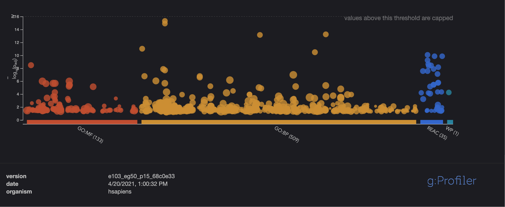
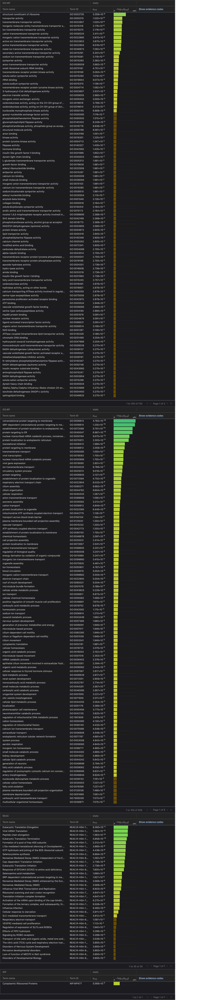

__Upregulated genes__  
BH FDR threshold of 0.05  
GO: Biological Process - 2,241  
GO: Molecular Function- 215  
WikiPathways- 14  
Reactome- 37  

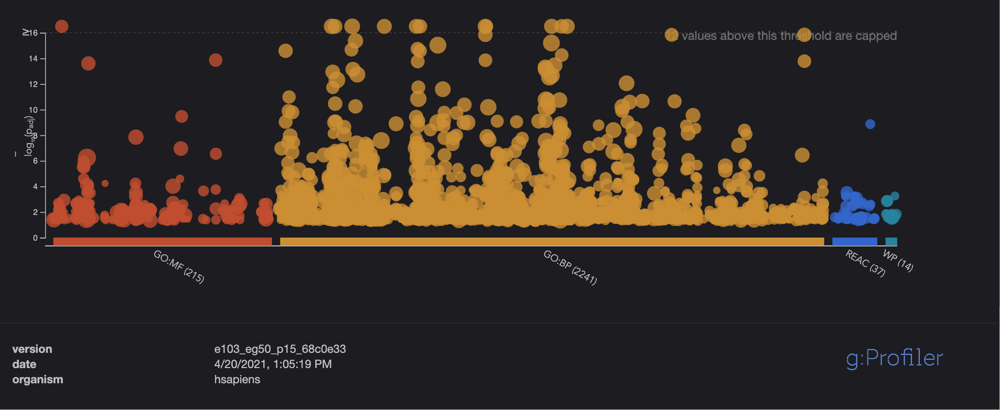


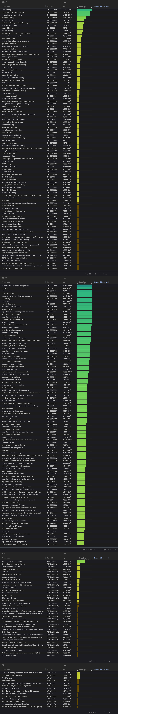
__Do the over-representation results support conclusions or mechanism discussed in the original paper?__

The over-representation results supports the discussions in the original paper. More specifically, upregulated gene analysis reveals an increase in expression among genes related to viral responses, such as RNA processing, response to cytokine, cytoskeletal rearrangement, and cell death which is hypothesized to contribute to more severe inflammation responses in the brain. Among the top hits in GO: BP, I can see that there are actin filament-based process, actin cytoskeleton organization, anatomical structure morphogenesis, and movement of cell or subcellular component, which are all involved in viral responses. Among the downregulated genes analysis, I could make a more straight forward comparison from the paper and my g:profiler results. The literature indicates that downregulated genes showed enrichment of genes related to ion transport, transmembrane transport, and cell junction. In the top hits of GO:BP , I can see transmembrane transport, ion transmembrane transport, cilium organization, all of which correspond to the original paper.

This concludes my summary of Assignment 1 and Assignment 2. I will be proceeding with Assignment 3.

# Assignment 3: Data Set Pathway and Network Analysis
## Non-Thresholded Gene Set Analysis
### Preparation
In order to perform GSEA analysis, we need a gmt file and a rank file. I  need to create a rank file from the differentially expressed genes from A2.
__Creating Rank File__
I first need to calculate the rank metric. I did this by taking the -log10(Pvale) and multiplied it by sign(logFC) for each gene expression. [4]
```{r}

ranked_genes <- data.frame(Genes=rownames(SARS.COV2OutputHits), 
                           Rank=-log(SARS.COV2OutputHits$table$PValue, base = 10) * sign(SARS.COV2OutputHits$table$logFC))
ranked_genes <- ranked_genes[order(ranked_genes$Rank, decreasing=TRUE),]
  
write.table(x=ranked_genes, file=file.path("dataBCB", "Ranked_Genes.rnk"),col.names = F,row.names = F, quote = F,sep="\t",)

```

__Download Expression Geneset__
The following code from lecture retrieves the latest gene set from Bader Lab in a gmt file
```{r warning=FALSE, message=FALSE}
gmt_url   <- "http://download.baderlab.org/EM_Genesets/current_release/Human/symbol/"
# list all the files on the server
filenames <- RCurl::getURL(gmt_url)
tc        <- textConnection(filenames)
contents  <- readLines(tc)
close(tc)
# get the gmt that has all the pathways and excludes terms inferred from
# electronic annotations(IEA) start with gmt file that has pathways only
rx <- gregexpr("(?<=<a href=\")(.*.GOBP_AllPathways_no_GO_iea.*.)(.gmt)(?=\">)",
               contents, 
               perl = TRUE)
gmt_file      <- unlist(regmatches(contents, rx))
dest_gmt_file <- file.path(getwd(), "./dataBCB", gmt_file)
download.file(paste(gmt_url, gmt_file, sep = ""),
              destfile = dest_gmt_file)
```


1. What method did you use? What genesets did you use? Make sure to specify versions and cite your methods. 
The method I used to conduct this analysis is GSEA Preranked analysis in the desktop application for Mac [reference]. I supplied the required files with the most recent geneset from the Bader Lab, containing GO biological process, no IEA and pathways, which produces a regularly updated and high quality geneset, as well as the ranked gene expression list produced above. The parameters used consisted of setting a minimum geneset size to 15 and a maximum of 200. This ensures that the results returned are more precise and informative. The number of permutations were left at the default 1000 and the chip platform parameter was set to Human_HGNC_ID_MSigDB.v7.4.chip. The methods used was following the third homework assignment. 

2. Summary of GSEA Enrichment results

__Upregulated Genes__  

2321 / 4797 gene sets are upregulated in phenotype na_pos  
513 gene sets are significant at FDR < 25%  
285 gene sets are significantly enriched at nominal pvalue < 1%  
586 gene sets are significantly enriched at nominal pvalue < 5%  

__Top 10 gene sets returned for Upregulated results:__
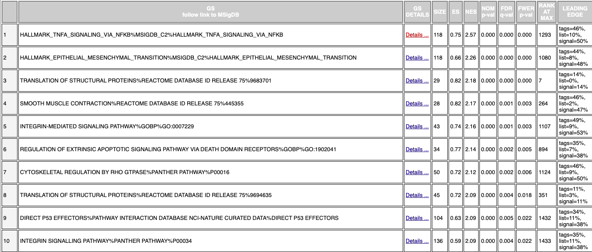
a. Top Geneset returned: HALLMARK_TNFA_SIGNALING_VIA_NFKB  
b. P-value:  
  i. Enrichment Score (ES): 0.7470998  
  ii. Normalized Enrichment Score (NES): 2.5744214  
  iii. FDR: 0.0  
c. Number of genes in its leading-edge: 118  
d. Top gene associated with this geneset: CYR61  


___Downregulated Genes___  

2476 / 4797 gene sets are upregulated in phenotype na_neg  
96 gene sets are significantly enriched at FDR < 25%  
110 gene sets are significantly enriched at nominal pvalue < 1%  
209 gene sets are significantly enriched at nominal pvalue < 5%  

__Top 10 gene sets returned for Downregulated results:__
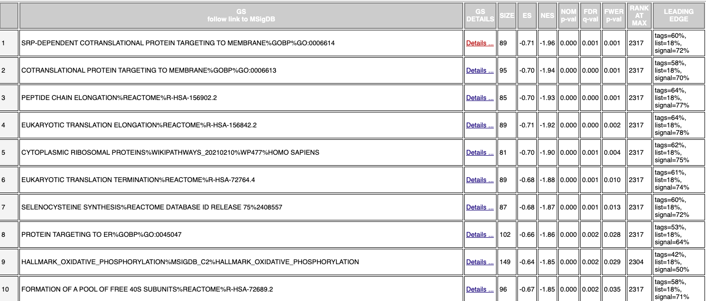
a. Top Geneset returned: SRP-DEPENDENT COTRANSLATIONAL PROTEIN TARGETING TO MEMBRANE  
b. P-value:  
  i. Enrichment Score (ES): -0.7051722  
  ii. Normalized Enrichment Score (NES): -1.961015  
  iii. FDR: 0.001  
c. Number of genes in its leading-edge: 89  
d. Top gene associated with this geneset: SRP19  

3. How do these results compare to the results from the thresholded analysis in Assignment #2. Compare qualitatively. Is this a straight forward comparison? Why or why not?

Upon taking a closer look at the top 10 genesets returned for upregulated and downregulated genesets, I can definitely see some similarities in the genes returned from the threshold analysis in assignment 2. However, I find that the information presented in the non-threshold analysis is more straightforward. I can make a more informed comparison with the genesets returned and the findings in the literature in terms of identifying which significant genesets are upregulated and downregulated. For example, the paper indicates that upregulated genes revealed an increase in inflammatory cytokines and interleukins such as IL-32, which plays a significant role in innate and adaptive immune responses by inducing tumor necrosis factor alpha (TNF-α), which in turn activates the signaling pathway of nuclear factor (NF-κB).[5] The top geneset returned in the non-threshold analysis for upregulated genes are in fact genes regulated in response to TNFA which activates NFKB. Furthermore, I can see genesets related integrin mediated signaling pathways, which corresponds to integrin-regulated cytoskeletal changes and cell migration [6] which corroborates the findings in Assignment 2. On the other hand with the top 10 downregulated genesets returned, I found there to be genesets related more so to transmembrane transport. All in all, I dont think this is a very straightforward comparison between non-threshold analysis and the threshold analysis conducting in A2, I had to search all the genesets returned and their functions before I could make a judgment on whether or not they correspond to the findings in A2. I found it to be more useful to compare the findings separately to the paper and then find similarities between the two analysis. I guess it is straightforward when I look closer at the types of genes returned in each geneset and how it relates to or doesnt to the genes returned in g:profiler.


## Visualize Gene set Enrichment Analysis in Cytoscape
Using your results from your non-thresholded gene set enrichment analysis visualize your results in Cytoscape.

1. Create an enrichment map - how many nodes and how many edges in the resulting map? What thresholds were used to create this map?
I first downloaded the Cytoscape desktop app via [cytoscape](http://cytoscape.org/)
188 Nodes and 646 edges
The thresholds used to create this map are: 
FDR cutoff value: 0.1
P-Value cutoff: 1.0
And all other parameters were set at default.

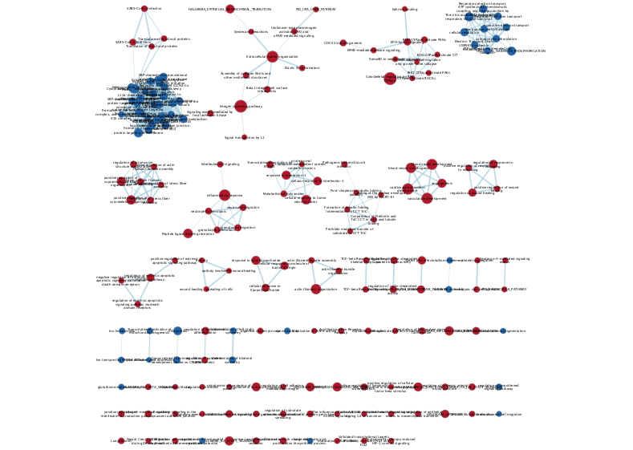

2. Annotate your network - what parameters did you use to annotate the network. If you are using the default parameters make sure to list them as well.  
The annotation tool I used is AutoAnnotate. 

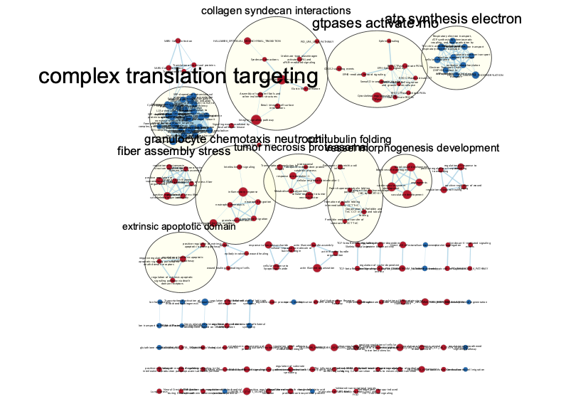


3. Make a publication ready figure - include this figure with proper legends in your notebook.


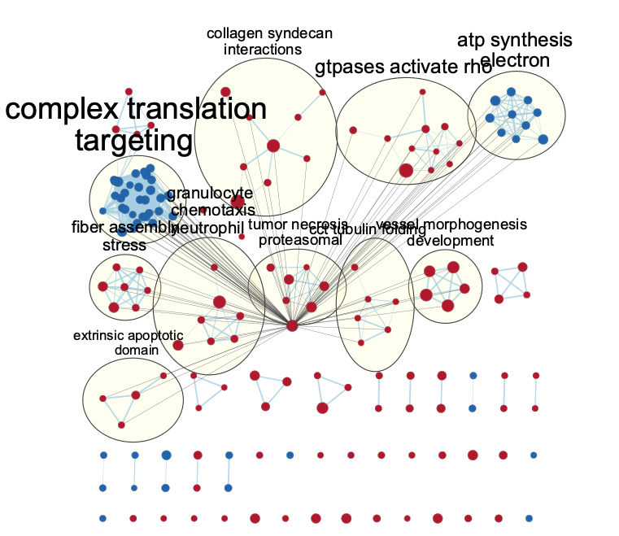


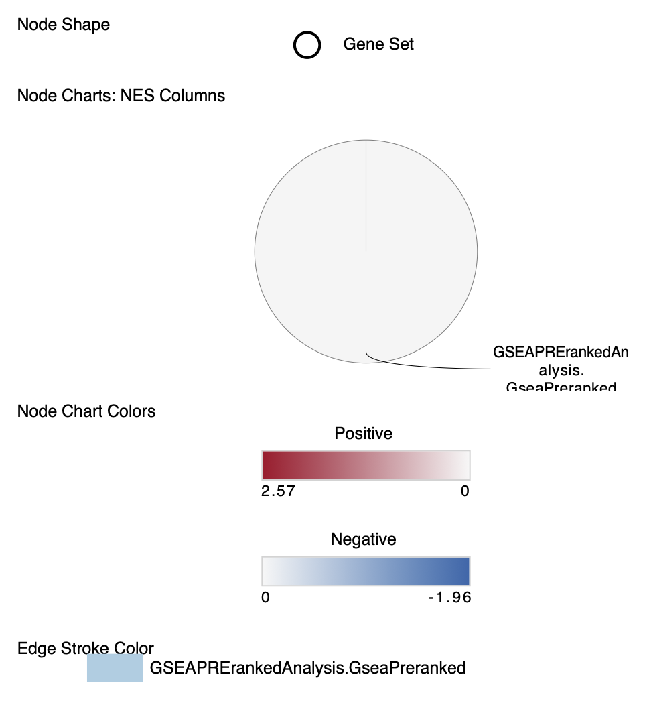

4. Collapse your network to a theme network. What are the major themes present in this analysis? Do they fit with the model? Are there any novel pathways or themes? 

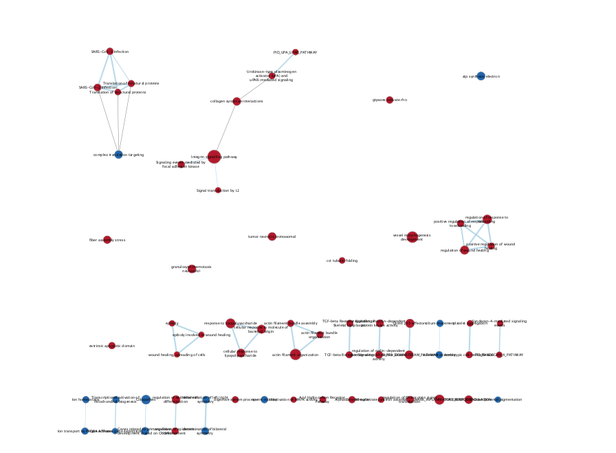


## Interpretation and detailed view of results
The most important aspect of the analysis is relating your results back to the initial data and question.

1. Do the enrichment results support conclusions or mechanism discussed in the original paper? How do these results differ from the results you got from Assignment #2 thresholded methods.

These enrichment results continue to support conclusions discussed in the original paper. Among the themes present I can see that they all correspond to finding from non-threshold analysis as well as threshold analysis. Upon taking a closer look, I can see that prevalent pathways such as the integrin signaling pathway, and complex translational pathways are also apparent in the non-threshold analysis. Furthermore, these enrichment results of downregulated genes correspond to findings in the paper with prevalent themes of ion transport, transmembrane transport, and cell junction. 

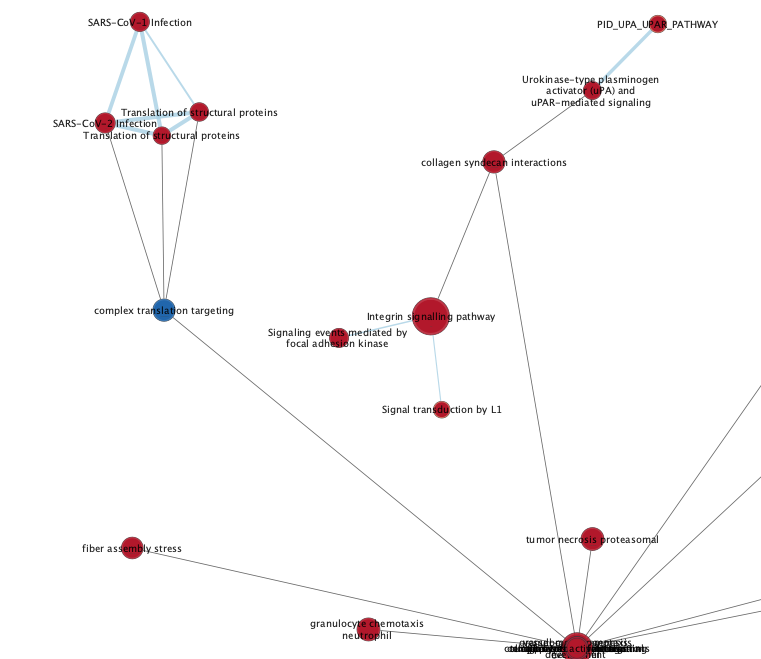
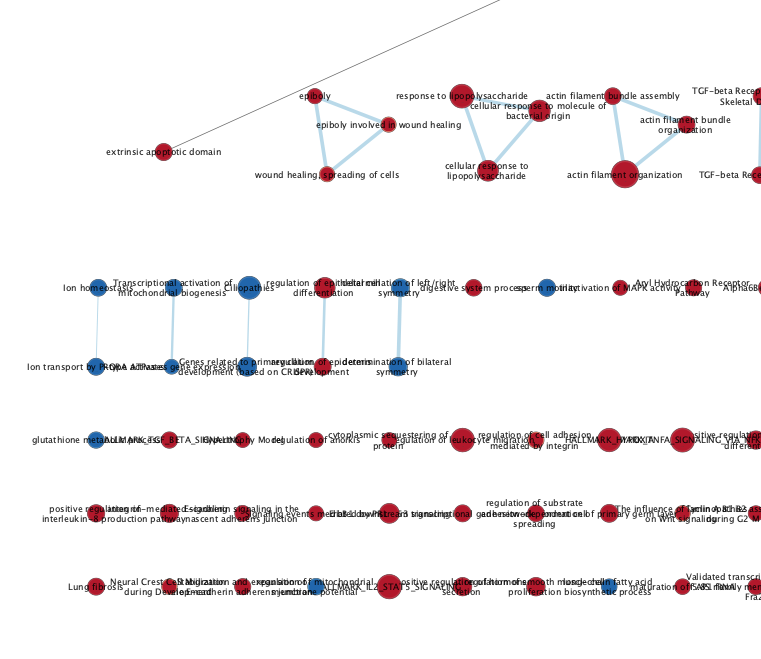

2. Can you find evidence, i.e. publications, to support some of the results that you see. How does this evidence support your result?

Downregulation of transporter and ion channels in the brain corresponds to functional deficits in normal cerebral spinal fluid secretion [2]. Furhtermore, the decreased expression in cell junctions corresponds to a remodelling or breakdown of the CSF-blood barrier function, which also occurs during brain inflammation [2]. I have further discussed these results above.


## Dark Matter Analysis

__Dark Matter Analysis__ is a useful technique to analyze the genes we have perhaps missed in our pathway analysis.

Files needed to conduct dark matter analysis:
- gmt file and rank file

```{r}
library(GSA)
gmtFile <- file.path(getwd(), "/dataBCB/Human_GOBP_AllPathways_no_GO_iea_March_01_2021_symbol.gmt")
capture.output(genesets<- GSA.read.gmt(gmtFile),file="gsa_load.out")
names(genesets$genesets) <- genesets$geneset.names

expressionmatrix <- readRDS(file=file.path(getwd(),"dataBCB","normalizedClean_counts.RDS"))
expression <- expressionmatrix
ranks <- ranked_genes

```

Get GSEA results file
```{r}
#get all the GSEA directories
gsea_directories <- list.files(path = file.path(getwd(),"dataBCB"), 
                               pattern = "\\.GseaPreranked")

if(length(gsea_directories) == 1){

  gsea_dir <- file.path(getwd(),"dataBCB", gsea_directories[1]) 
  #get the gsea result files
  gsea_results_files <- list.files(path = gsea_dir,
                                   pattern = "gsea_report_*.*.tsv")
  #there should be 2 gsea results files
  enr_file1 <- read.table(file.path(gsea_dir,gsea_results_files[1]), 
                        header = TRUE, sep = "\t", quote="\"",
                        stringsAsFactors = FALSE,row.names=1) 

  enr_file2 <- read.table(file.path(gsea_dir,gsea_results_files[1]),
                        header = TRUE, sep = "\t", quote="\"", 
                        stringsAsFactors = FALSE,row.names=1)
}
```

For each gene sets in gmt file, collect the data of all genes in the expression set, all genes in the enrichment result, and all genes in the significant enrichment results, and add them to cumulative set of all enrichment gene sets.
```{r}
FDRThreshold <- 0.01
#get the genes from the set of enriched pathways (no matter what threshold)
allSigEnrGenesets<- c(rownames(enr_file1)[which(enr_file1[,"FDR.q.val"]<=FDRThreshold)],
                      rownames(enr_file2)[which(enr_file2[,"FDR.q.val"]<=FDRThreshold)])

genesSigEnrGs <- c()

for(i in 1:length(allSigEnrGenesets)){
  current_geneset <- unlist(genesets$genesets[which(genesets$geneset.names %in% allSigEnrGenesets[i])]) 
  genesSigEnrGs <- union(genesSigEnrGs, current_geneset)
}

genes_all_gs <- unique(unlist(genesets$genesets))
```

__Genes in all Pathways without Annotations__
```{r}
genes_no_annotation <- setdiff(rownames(SARS.COV2OutputHits$table)[SARS.COV2OutputHits$table$FDR <0.05], genes_all_gs)
ranked_gene_no_annotation <- ranks[which(ranks[,1] %in% genes_no_annotation),]
ranked_gene_no_annotation[1:10,]
# 207 genes
```


__Genes in Enrichment Pathways without Annotations__
```{r}
genesSigEnr_no_annotation <- setdiff(rownames(SARS.COV2OutputHits$table)[SARS.COV2OutputHits$table$FDR <0.01], genesSigEnrGs)
ranked_genesSigEnr_no_annotation <- ranks[which(ranks[,1] %in% genesSigEnr_no_annotation),]
ranked_genesSigEnr_no_annotation[1:10,] #576
```

### Visualization: Venn Diagram
```{r}
library("VennDiagram")
A <- genes_all_gs
B <- genesSigEnrGs
C <- rownames(SARS.COV2OutputHits$table)[SARS.COV2OutputHits$table$FDR <0.05]

png(file.path(getwd(),"figures", "darkMatterOverlaps.png"))

venn.plot<- draw.triple.venn(
    area1=length(A), 
    area2=length(B), 
    area3 = length(C),
    n12 = length(intersect(A,B)),
    n13=length(intersect(A, C)), 
    n23 = length(intersect(B,C)),
    n123 = length(intersect(A,intersect(B,C))), 
    category = c("all genesets", "all enrichment results", "expression"),
    fill = c("red","green","blue"),
    cat.col = c("red","green","blue")
  )
grid.draw(venn.plot)
dev.off()
```

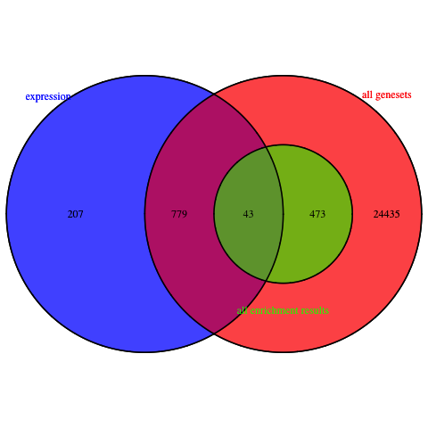


### Visualization: Heatmap

#### Visualization of significant genes that are not annotated to any pathways in entire set of pathways.
```{r}
heatmapMatrix <- t(scale(t(normalized_data)))

tophits <- ranked_gene_no_annotation$Genes

heatmap_tophits <- t(scale(t(heatmapMatrix[which(rownames(heatmapMatrix) %in% tophits), ])))


if(min(top_hits) == 0){
  heatmapCol = circlize::colorRamp2(c(min(heatmap_tophits), 0, max(heatmap_tophits)), 
                                  c("blue", "white", "red"))
  } else {
    heatmapCol = circlize::colorRamp2(c(min(heatmap_tophits), 0, max(heatmap_tophits)), 
                                      c("blue", "white", "red"))
  }

#heatmap annotations
ha <- ComplexHeatmap::HeatmapAnnotation(
                                   type = anno_block(gp = gpar(fill = 2:4), 
                                   labels = c("Mock-72hpi", "SARS-CoV-2-24hpi", "SARS-Cov2-72hpi"), 
                                   labels_gp = gpar(col = "white", fontsize = 10)))
                                   split = rep(1:3, each = 3)

heatmap1 <- ComplexHeatmap::Heatmap(as.matrix(heatmap_tophits), 
                                   cluster_rows = TRUE,
                                   cluster_columns = FALSE,
                                   show_row_dend = TRUE, 
                                   show_column_dend = FALSE, 
                                   col = heatmapCol, 
                                   show_column_names = TRUE, 
                                   show_row_names = FALSE, 
                                   show_heatmap_legend = TRUE,
                                   column_split = split,
                                   top_annotation = ha,
                                   column_title = NULL)
heatmap1
```


#### Visualization of significant genes that are not annotated to any pathways returned in the enrichment analysis

```{r}
heatmapM <- t(scale(t(normalized_data)))

topHits <- ranked_genesSigEnr_no_annotation$Genes

heatmapTophits <- t(scale(t(heatmapM[which(rownames(heatmapM) %in% topHits), ])))


if(min(top_hits) == 0){
  heatmapCol = circlize::colorRamp2(c(min(heatmapTophits), 0, max(heatmapTophits)), 
                                  c("blue", "white", "red"))
  } else {
    heatmapCol = circlize::colorRamp2(c(min(heatmapTophits), 0, max(heatmapTophits)), 
                                      c("blue", "white", "red"))
  }

#heatmap annotations
ha <- ComplexHeatmap::HeatmapAnnotation(
                                   type = anno_block(gp = gpar(fill = 2:4), 
                                   labels = c("Mock-72hpi", "SARS-CoV-2-24hpi", "SARS-Cov2-72hpi"), 
                                   labels_gp = gpar(col = "white", fontsize = 10)))
                                   split = rep(1:3, each = 3)

heatmap2 <- ComplexHeatmap::Heatmap(as.matrix(heatmapTophits), 
                                   cluster_rows = TRUE,
                                   cluster_columns = FALSE,
                                   show_row_dend = TRUE, 
                                   show_column_dend = FALSE, 
                                   col = heatmapCol, 
                                   show_column_names = TRUE, 
                                   show_row_names = FALSE, 
                                   show_heatmap_legend = TRUE,
                                   column_split = split,
                                   top_annotation = ha,
                                   column_title = NULL)
heatmap2
```

## Conclusion
The significant genes without annotations in the enrichment pathways appear to be more downregulated and clustered in comparason to the significant genes without annotations in all pathways. Perhaps this suggests that the ones in the enrichment pathways are more significant and play a larger role.

# References  

1. GSE https://www.ncbi.nlm.nih.gov/geo/query/acc.cgi?acc=GSE157852  
2. Mao L., Jin H., Wang M., Hu Y., Chen S., He Q., Chang J., Hong C., Zhou Y., Wang D. Neurologic manifestations of hospitalized patients with coronavirus disease 2019 in Wuhan, China. JAMA Neurol. 2020;77:683–690  
3. Jacob, F., Pather, S. R., Huang, W. K., Zhang, F., Wong, S., Zhou, H., Cubitt, B., Fan, W., Chen, C. Z., Xu, M., Pradhan, M., Zhang, D. Y., Zheng, W., Bang, A. G., Song, H., Carlos de la Torre, J., & Ming, G. L. (2020). Human Pluripotent Stem Cell-Derived Neural Cells and Brain Organoids Reveal SARS-CoV-2 Neurotropism Predominates in Choroid Plexus Epithelium. Cell stem cell, 27(6), 937–950.e9. https://doi.org/10.1016/j.stem.2020.09.016   

4. Computing ranked gene list http://genomespot.blogspot.com/2016/04/how-to-generate-rank-file-from-gene.html  

5.  Upregulated geneset https://www.gsea-msigdb.org/gsea/msigdb/cards/HALLMARK_TNFA_SIGNALING_VIA_NFKB.html  

6. https://pubmed.ncbi.nlm.nih.gov/10425567/  

7. https://github.com/cytoscape/cytoscape-tutorials/wiki  

8. BCB420 2021 Course Notes; by Ruth Isserlin


## Packages Used
1.  Martin Morgan (2019). BiocManager: Access the Bioconductor Project Package Repository. R package version 1.30.10. https://CRAN.R-project.org/package=BiocManager  
2.  Zhu Y, Davis S, Stephens R, Meltzer PS, Chen Y. GEOmetadb: powerful alternative search engine for the Gene Expression Omnibus.   Bioinformatics. 2008 Dec  
    1;24(23):2798-800. doi: 10.1093/bioinformatics/btn520. Epub 2008 Oct 7. PubMed PMID: 18842599; PubMed Central PMCID: PMC2639278.
3.  Gu, Z. (2016) Complex heatmaps reveal patterns and correlations in multidimensional genomic data. Bioinformatics.  
4.  Hadley Wickham, Romain François, Lionel Henry and Kirill Müller (2021). dplyr: A Grammar of Data Manipulation. R package version 1.0.5.
    https://CRAN.R-project.org/package=dplyr  
5.  Robinson MD, McCarthy DJ and Smyth GK (2010). edgeR: a Bioconductor package for differential expression analysis of digital gene expression data. Bioinformatics 26, 139-140  
6.  H. Wickham. ggplot2: Elegant Graphics for Data Analysis. Springer-Verlag New York, 2016.  
7.  Hadley Wickham (2021). tidyr: Tidy Messy Data. R package version 1.1.3. https://CRAN.R-project.org/package=tidyr  
8.  Gu, Z. (2014) circlize implements and enhances circular visualization in R. Bioinformatics.  
9. Yihui Xie (2021). knitr: A General-Purpose Package for Dynamic Report Generation in R. R package version 1.31.  
10. Liis Kolberg and Uku Raudvere (2020). gprofiler2: Interface to the 'g:Profiler' Toolset. R package version 0.2.0.  https://CRAN.R-project.org/package=gprofiler2  
11.  Gu, Z. (2016) Complex heatmaps reveal patterns and correlations in multidimensional genomic data. Bioinformatics.  
12.   Hanbo Chen (2018). VennDiagram: Generate High-Resolution Venn and Euler Plots. R package version 1.6.20.
  https://CRAN.R-project.org/package=VennDiagram  
13.   Brad Efron and R. Tibshirani (2019). GSA: Gene Set Analysis. R package version 1.03.1.
  https://CRAN.R-project.org/package=GSA  

